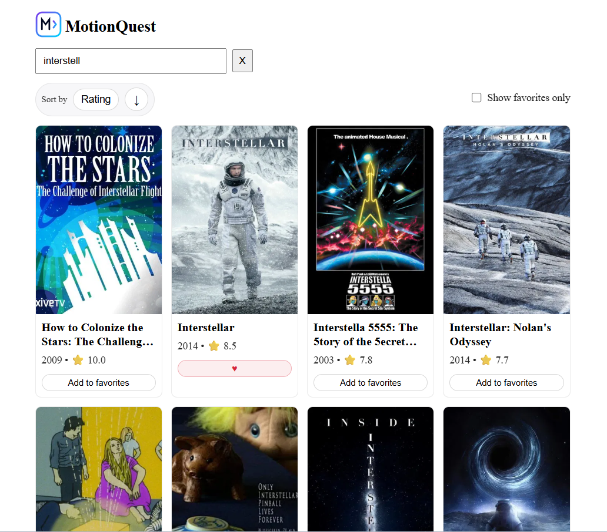
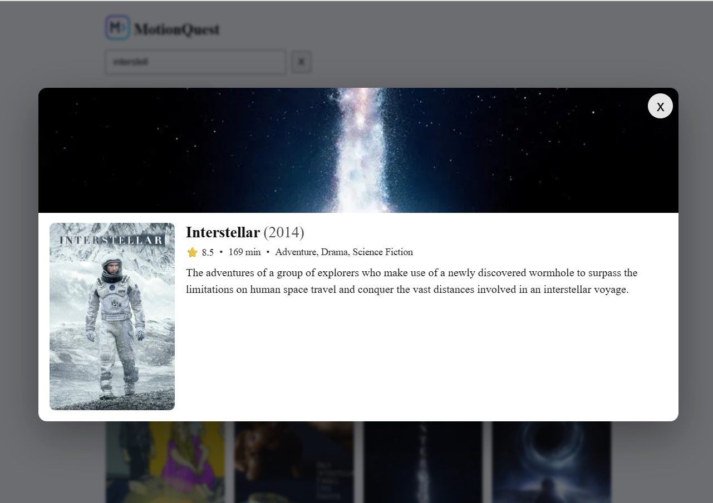

# MotionQuest

Search your next film to watch.





## 📚 Overview

**MotionQuest** is a lightweight movie search app built with **React.js**.

---

## ✨ Features

- **Search Movies** – Find titles via the TMDB API.
- **Favorites List** – add/remove movies from favorite list.
- **Movie Details Modal** – Title, overview, release date, rating.
- **Sort by Rating/Year** – Toggle sort and direction.
- **Local Persistence** – Saves your data in your browser so that it survives browsing sessions.

---

## 🛠️ Tech Stack

- **Frontend:** React.js
- **Styling:** CSS
- **Data:** TMDB API (v3)
- **Data Storage:** localStorage
- **Linting & Formatting:** ESLint, Prettier
- **Package Manager:** npm

---

## 🚀 Getting Started

1. **Clone the repository:**

    ```bash
    git clone https://github.com/Wilfried-O/motionquest.git
    ```

2. **Navigate to the project directory:**

    ```bash
    cd motionquest
    ```

3. **Install dependencies:**

    ```bash
    npm install
    ```

4. **Add your API key:**

    Create a `.env.local` file in the project root and add:

    ```
    REACT_APP_TMDB_API_KEY=your_api_key_here
    ```

5. **Start the development server:**

    ```bash
    npm start
    ```

6. **Open in your browser:**  
   [http://localhost:3000](http://localhost:3000)

---

## 🔑 Environment

| Variable                    | Description                   | Required | Default                        |
| --------------------------- | ----------------------------- | -------- | ------------------------------ |
| `REACT_APP_TMDB_API_KEY`    | Your TMDB API key.            | ✅ Yes   | —                              |
| `REACT_APP_TMDB_API_BASE`   | Base URL for movies requests. | ❌ No    | `https://api.themoviedb.org/3` |
| `REACT_APP_TMDB_IMAGE_BASE` | Base URL for images requests. | ❌ No    | `https://image.tmdb.org/t/p/`  |

> ⚠️ You should put your (secret) API key in `.env.local`, the other variables can be inside `.env`.
> After changing your _env_ files, restart the development server to apply the new values.  
> Please note that, _only_ variables starting with `REACT_APP_` are accessible in Create React App.

---

## 📋 Project Status

- ✅ **Feature complete:**
    - Search movies and show results
    - Favorites list (persist to `localStorage`)
    - Movie details modal
    - Sorting (rating/year, asc/desc)

- ⚙️ **Work in Progress:**
    - Refactoring and cleanup (add CSS Modules for components)
    - Improve styling to make the look more polished

### 🧭 Next Steps

- Add dark mode
- Support French language

## 🤖 AI Assistance

This project uses AI assistance for planning, coding, and debugging.  
All code is reviewed and fully understood by the author to ensure quality, clarity, and safety.

---

## 📄 License

This project is licensed under the **MIT License**.
